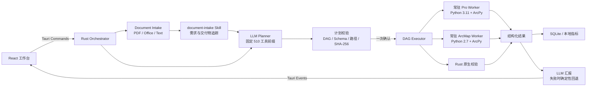
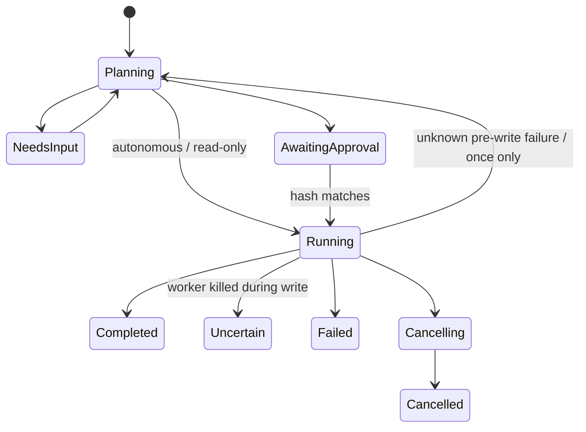

# GISdo architecture

## Task state

## Security boundaries

The frontend never opens SQLite, reads credentials, builds Worker parameters, or accesses the filesystem. Every write is derived and checked twice: first by Rust against the repository tool registry, then by the Python Worker against live ArcPy parameter metadata. `arcpy.env.overwriteOutput` is always false.

Windows Credential Manager holds the LLM API key. SQLite stores only `llm-api-key`. Worker stdout is protocol-only UTF-8 JSON Lines; any non-JSON stdout is a protocol failure.

## Worker lifetime

Workers preheat 200 ms after Tauri setup. A runtime has one in-flight operation and a Rust queue. The supervisor recycles after 20 tasks, 1.5 GB resident memory, protocol damage, or a severe ArcPy exception. A Windows Job Object terminates descendants when the desktop app exits.
